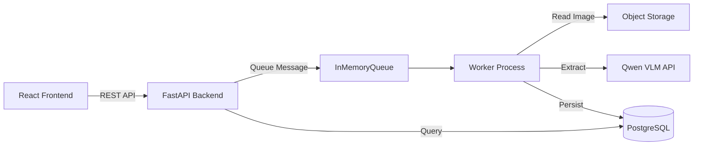

# Business Card AI — VLM Lead Extraction

AI-powered business card lead extraction application using a **Qwen Vision-Language Model** to convert business card images into structured contact data.

## ✨ Features

- **Bulk Upload** — Upload multiple business card images at once (JPEG, PNG, WebP)
- **AI Extraction** — Qwen VLM processes images and extracts structured lead data
- **Async Processing** — Queue-based architecture with real-time progress tracking
- **Lead Display** — View all extracted contacts in a clean, sortable table
- **Excel Export** — Download leads as a professionally formatted XLSX file
- **Idempotent Uploads** — Duplicate images are detected via SHA-256 hashing
- **Partial Failure Handling** — Individual file failures don't block the batch

## 🏗 Architecture



### System Flow

1. **Create Job** → User specifies expected number of business cards
2. **Upload Images** → Files are validated, hashed, stored, and queued for processing
3. **Async Processing** → Worker consumes queue messages, invokes Qwen VLM inference
4. **Validation** → Extracted JSON is validated against Lead schema (Pydantic v2)
5. **Persistence** → Leads, extractions, and job progress stored in PostgreSQL
6. **Display** → Frontend polls job status, displays progress and extracted leads
7. **Export** → Download all leads as an Excel spreadsheet

### Why Async Processing?

Business card OCR via a vision-language model takes 5-30 seconds per image. Synchronous processing would block the API and cause timeouts on bulk uploads. The queue-based architecture:

- Decouples upload from processing (fast HTTP responses)
- Enables parallel processing (multiple workers)
- Provides progress tracking (frontend polls status)
- Handles partial failures gracefully (one bad image doesn't block others)

## 🛠 Technology Stack

| Component | Technology |
|---|---|
| Backend API | FastAPI (Python 3.12+) |
| Worker | Custom queue consumer |
| Database | PostgreSQL 17 |
| ORM | SQLAlchemy 2.0 |
| Migrations | Alembic |
| Validation | Pydantic v2 |
| Inference | Qwen VLM (OpenAI-compatible API) |
| Frontend | React + TypeScript + Vite |
| Excel Export | openpyxl |
| Queue | InMemoryQueue (SQS-compatible interface) |
| Storage | Local filesystem (S3-compatible interface) |

## 📋 API Endpoints

| Method | Endpoint | Description |
|---|---|---|
| `POST` | `/jobs` | Create a new extraction job |
| `GET` | `/jobs/{id}` | Get job status and progress |
| `POST` | `/jobs/{id}/documents` | Upload a single document |
| `POST` | `/jobs/{id}/documents/bulk` | Upload multiple documents |
| `GET` | `/jobs/{id}/leads` | Get extracted leads for a job |
| `GET` | `/jobs/{id}/export/xlsx` | Download leads as Excel file |
| `GET` | `/health` | Health check |

## 🚀 Local Setup

### Prerequisites

- Python 3.12+
- Node.js 20+
- Docker (for PostgreSQL)
- [uv](https://docs.astral.sh/uv/) (Python package manager)

### 1. Start PostgreSQL

```bash
docker compose -f infra/docker-compose.dev.yml up -d
```

### 2. Configure Environment

```bash
cp .env.example .env
# Edit .env with your inference API credentials:
#   INFERENCE_BASE_URL=<your-qwen-api-url>
#   INFERENCE_MODEL=<model-name>
#   INFERENCE_API_KEY=<your-api-key>
```

### 3. Install Python Dependencies

```bash
uv venv .venv
uv pip install -e ".[dev]"
```

### 4. Run Database Migrations

```bash
alembic upgrade head
```

### 5. Start the API Server

```bash
uvicorn apps.api.main:app --reload --host 0.0.0.0 --port 8000
```

### 6. Start the Worker (separate terminal)

```bash
python -m apps.worker
```

### 7. Start the Frontend (separate terminal)

```bash
cd apps/frontend
npm install
npm run dev
```

The application will be available at **http://localhost:5173**

## 🔬 Running Tests

```bash
# Run all tests
python -m pytest tests/ -q

# Run specific test categories
python -m pytest tests/contract/ -q          # Contract tests
python -m pytest tests/integration/ -q -m integration  # Integration tests (needs PostgreSQL)
```

## 🌐 Environment Variables

| Variable | Description | Default |
|---|---|---|
| `DATABASE_URL` | PostgreSQL connection string | Required |
| `MAX_FILE_SIZE_MB` | Maximum upload file size | 10 |
| `MAX_FILES_PER_JOB` | Maximum files per job | 50 |
| `INFERENCE_BASE_URL` | Qwen API base URL | `http://localhost:8001/v1` |
| `INFERENCE_MODEL` | Model name | `Qwen/Qwen3-VL-8B-Instruct` |
| `INFERENCE_API_KEY` | API key for inference | `local-dev` |
| `INFERENCE_TIMEOUT_SECONDS` | Inference timeout | 60 |

## 📊 Extracted Lead Fields

| Field | Description |
|---|---|
| First Name | Contact's first name |
| Last Name | Contact's last name |
| Position / Job Title | Professional title |
| Company | Organization name |
| Location | City, region, or country |
| Phone Number | Phone with country code |
| Email Address | Validated email address |

## 🔒 Security

- API keys and secrets are stored in `.env` (gitignored)
- No credentials are committed to the repository
- File uploads are validated for MIME type, size, and content hash
- SQL injection prevention via parameterized queries (SQLAlchemy ORM)

## 🔮 Future Production Roadmap

After assignment submission, the architecture is designed to scale to:

- **AWS EKS** with Kubernetes deployment
- **Amazon SQS** replacing InMemoryQueue
- **Amazon S3** replacing local object storage
- **Self-hosted vLLM** or managed Qwen endpoint
- **KEDA** auto-scaling workers based on queue depth
- **Terraform** infrastructure-as-code
- **OpenTelemetry** observability

## 📁 Project Structure

```
business-card-ai/
├── apps/
│   ├── api/              # FastAPI application
│   │   ├── routers/      # HTTP endpoints
│   │   ├── schemas.py    # Request/response models
│   │   └── main.py       # App entry point
│   ├── frontend/         # React + TypeScript + Vite
│   ├── inference/        # Qwen VLM client
│   └── worker/           # Queue consumer + document processor
├── packages/
│   ├── common/           # Shared: models, repos, services, storage
│   └── schemas/          # Domain models (Pydantic v2)
├── tests/
│   ├── contract/         # Unit + contract tests
│   └── integration/      # PostgreSQL integration tests
├── infra/
│   ├── alembic/          # Database migrations
│   └── docker-compose.dev.yml
└── pyproject.toml
```
