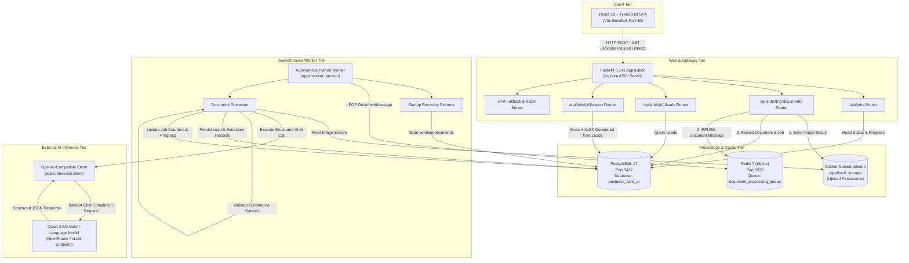
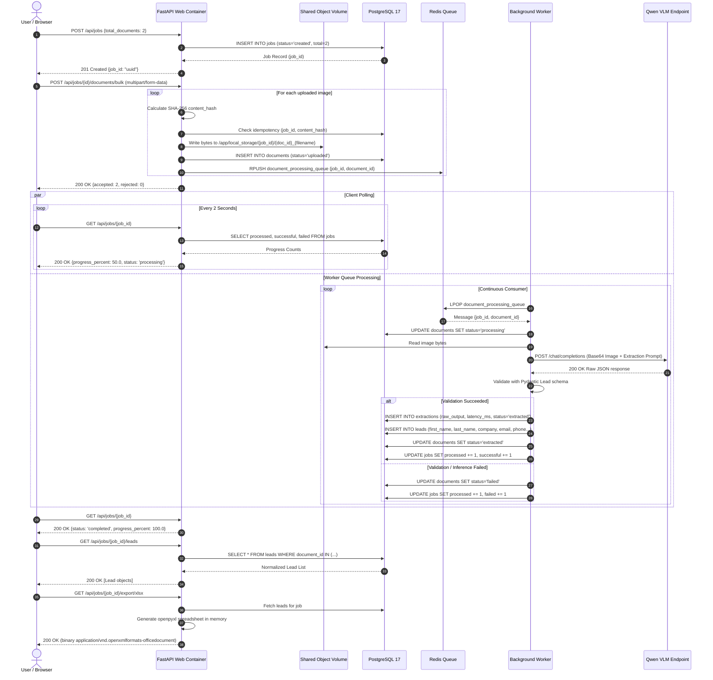
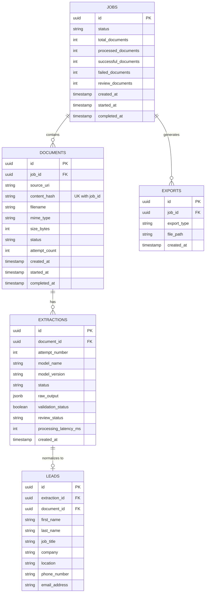
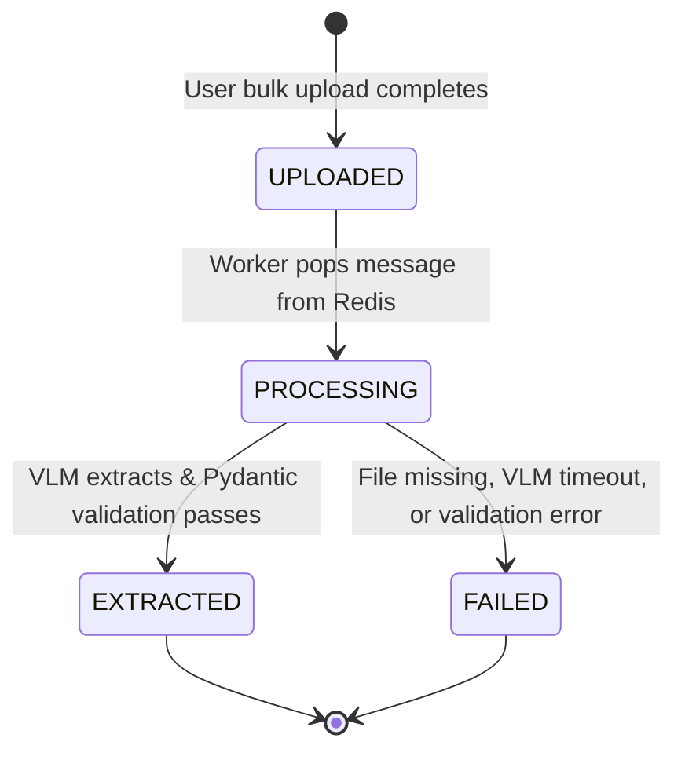
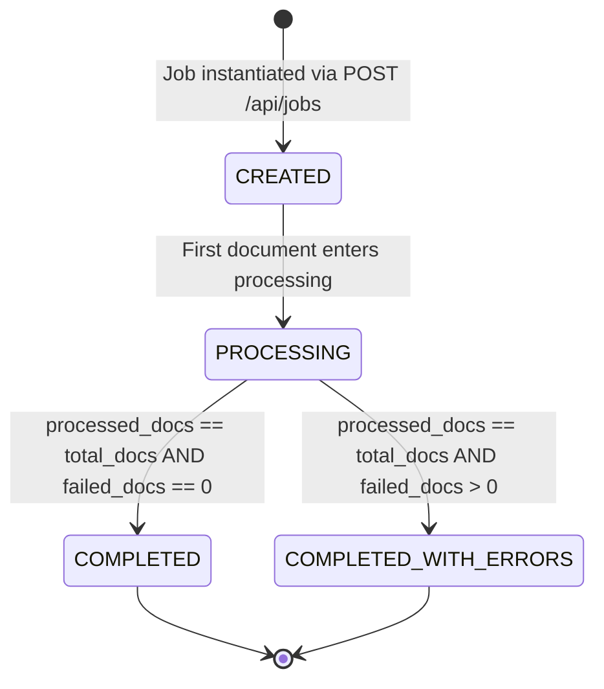

# System Architecture & Technical Specifications

> Deep-dive architectural documentation for the **Business Card AI** lead extraction platform.

This document details the high-level architecture, subsystem boundaries, data contracts, and design trade-offs governing the Business Card AI platform.

---

## 1. High-Level Architecture Overview

Business Card AI uses an **event-driven, decoupled asynchronous architecture**. The system separates latency-sensitive client HTTP requests from multi-second Vision-Language Model (VLM) inference workloads using a Redis-backed queue and an independent worker runtime.



---

## 2. Component Specifications

### 2.1. Frontend Tier (`apps/frontend`)
- **Technology**: React 18, TypeScript, Vite.
- **Responsibility**: Provides the user interface for bulk image selection, drag-and-drop file ingestion, dynamic job initialization, real-time progress visualization, lead table sorting/inspection, and XLSX export triggering.
- **State Machine**:
  - `IDLE`: User selects expected document volume and triggers job creation.
  - `UPLOADING`: Files stream to `/api/jobs/{job_id}/documents/bulk` via `multipart/form-data`.
  - `PROCESSING`: Polls `GET /api/jobs/{job_id}` at 1.5–2.0-second intervals to compute completion percentage, processing rate, and partial failure counters.
  - `COMPLETED / COMPLETED_WITH_ERRORS`: Automatically transitions to load extracted leads (`GET /api/jobs/{job_id}/leads`) and activates the Excel download action.
- **Zero CORS / Production Parity**: In development, Vite reverse-proxies `/api` to port 8000. In production, FastAPI serves the compiled React distribution (`dist/`) directly on port 80 with an HTML5 history fallback (`serve_spa`).

### 2.2. Web & API Tier (`apps/api`)
- **Technology**: FastAPI 0.141+, Uvicorn 0.30+, Python 3.12.
- **Responsibility**: Validates upload requests, manages job state transitions, accepts file uploads, hashes files for idempotency, pushes document keys to Redis, and queries data.
- **Key Modules**:
  - `main.py`: Configures CORS middleware, lifespan events, SPA static mounting, health check (`/health`), and router prefixes.
  - `routers/jobs.py`: Job lifecycle management (`POST /jobs`, `GET /jobs/{id}`, `GET /jobs/{id}/leads`).
  - `routers/documents.py`: Single and bulk file upload endpoint (`POST /jobs/{id}/documents/bulk`).
  - `routers/exports.py`: Dynamic XLSX binary streaming (`GET /jobs/{id}/export/xlsx`).
- **Bulk Upload Resiliency**: Each uploaded file in a batch is validated independently. An unsupported MIME type or oversized image in a 20-card upload triggers an isolated rejection without aborting the accepted files.

### 2.3. Asynchronous Message Queue (`packages/common/queue.py`)
- **Technology**: Redis 7 on Alpine Linux.
- **Responsibility**: Decouples API file ingestion from multi-second Vision-Language Model processing.
- **Data Contract**:
  ```python
  @dataclass(frozen=True)
  class DocumentMessage:
      job_id: str
      document_id: str
  ```
- **Queue Semantics**:
  - Producer: Web container executes `RPUSH document_processing_queue json_payload`.
  - Consumer: Worker daemon executes `LPOP document_processing_queue` in a non-blocking pull loop with idle backoff.
  - Test Isolation: The `create_queue()` factory automatically provisions `InMemoryQueue` for unit and contract tests, and activates `RedisQueue` when `REDIS_URL` is set in the runtime environment.

### 2.4. Dedicated Background Worker (`apps/worker`)
- **Technology**: Standalone Python 3.12 daemon container.
- **Responsibility**: Consumes messages from Redis, retrieves image bytes from shared storage, orchestrates VLM inference, validates output against schema rules, records audit extractions, and persists normalized leads.
- **Resilience Features**:
  - **Error Isolation**: Catches `ValidationError`, `FileNotFoundError`, and API timeouts per document. A corrupt document is marked `failed` in PostgreSQL, updating the job progress without terminating the worker loop.
  - **Startup Recovery**: On worker initialization (`apps/worker/__main__.py`), `recover_unprocessed_documents()` queries PostgreSQL for documents stuck in `uploaded` or `processing` states (e.g., following a server reboot) and reenqueues them into Redis.

### 2.5. Vision-Language Inference Client (`apps/inference`)
- **Technology**: OpenAI-compatible HTTP client protocol via `httpx`.
- **Model**: `Qwen/Qwen2.5-VL-72B-Instruct` or `qwen/qwen3-vl-30b-a3b-instruct` (via OpenRouter or self-hosted vLLM).
- **Prompt Architecture**:
  - System Prompt: Defines strict extraction boundaries. The model is commanded to extract *only* text explicitly visible on the business card, never hallucinate missing contact fields, format phone numbers with international codes, and return `null` for absent fields.
  - Format Enforcement: Enforces schema compliance via structured JSON prompt framing and low temperature (`0.0 - 0.1`) to ensure determinism.

### 2.6. Data Validation & Normalization (`packages/schemas`)
- **Technology**: Pydantic v2.
- **Contract**:
  ```python
  class Lead(BaseModel):
      first_name: str | None = None
      last_name: str | None = None
      job_title: str | None = None
      company: str | None = None
      location: str | None = None
      phone_number: str | None = None
      email_address: EmailStr | None = None
  ```
- **Hallucination Barrier**: Raw model output is never passed directly to the database. If the VLM produces invalid email formats, malformed syntax, or unexpected keys, Pydantic raises `ValidationError`, preventing corrupt records from polluting the persistence layer.

### 2.7. Relational Persistence Tier (`packages/common/models.py`)
- **Technology**: PostgreSQL 17, SQLAlchemy 2.0 ORM, Alembic migrations.
- **Schema Design**:
  - `jobs`: Master batch record tracking document counts, success/failure tally, and timestamps.
  - `documents`: Individual file metadata, MIME type, size, SHA-256 hash, and execution status.
  - `extractions`: Audit record preserving model name, version, latency in milliseconds, validation status, and raw JSON response for traceability.
  - `leads`: Structured contact information linked directly to the parent document and extraction.
  - `exports`: Audit log of XLSX downloads.

---

## 3. Detailed Sequence Flow: Bulk Upload to Lead Persistence

The diagram below details the chronological message passing, database transactions, and queue interactions across all five tiers:



---

## 4. Entity-Relationship (ER) Schema Model



---

## 5. State Machine: Job & Document Lifecycles

### 5.1. Document State Transitions



### 5.2. Job State Transitions



---

## 6. Key Design Decisions & Trade-Offs

| Decision | Alternative Considered | Chosen Approach | Justification |
|---|---|---|---|
| **Queue Architecture** | Celery + RabbitMQ | Custom Redis List (`rpush`/`lpop`) | Celery + RabbitMQ requires heavy broker runtimes, complex AMQP configuration, and large RAM footprints unsuitable for an AWS Free Tier `t2.micro`/`t3.micro` instance. Redis list primitives provide FIFO ordering, sub-millisecond latencies, and minimal memory (<30MB RAM). |
| **Worker Boundary** | In-process FastAPI `BackgroundTasks` | Dedicated Worker Container | FastAPI background tasks run in the same GIL and event loop as web requests. Multi-second VLM inference blocks Python worker threads and starves incoming HTTP uploads. A separate worker container guarantees full CPU and memory isolation. |
| **Idempotency** | Filename uniqueness | SHA-256 Image Content Hash | Business cards are often uploaded with generic filenames (e.g., `IMG_001.jpg`, `card.png`). Hashing raw binary bytes ensures true content-based deduplication across repeated batch attempts. |
| **Model Protocol** | Vendor-locked SDK (e.g., DashScope) | Standard OpenAI-Compatible Interface | Decouples the application from a single inference vendor. The system can switch between OpenRouter, local vLLM instances, or cloud endpoints solely by updating `INFERENCE_BASE_URL` and `INFERENCE_MODEL` in `.env`. |
| **Storage Architecture** | Direct S3 Upload with Pre-signed URLs | Shared Local Volume (`/app/local_storage`) | Kept the assignment deployment standalone and fully self-contained on EC2 without requiring AWS IAM credentials or external S3 bucket setup. Layered behind an `ObjectStorage` abstraction for clean future cloud migration. |
| **Frontend Packaging** | Separate Nginx Container or S3 static hosting | Unified FastAPI Static Serving (`dist/`) | Eliminates the operational burden and memory overhead of running an extra Nginx container on a 1GB RAM instance, while avoiding CORS issues via same-origin API routing. |
